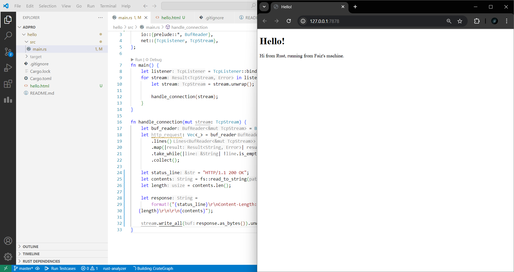
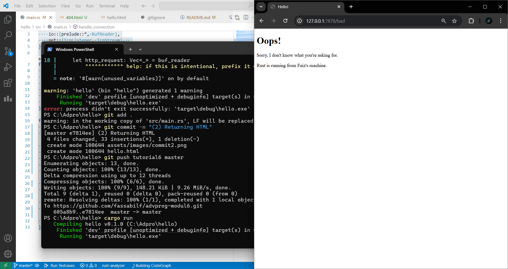
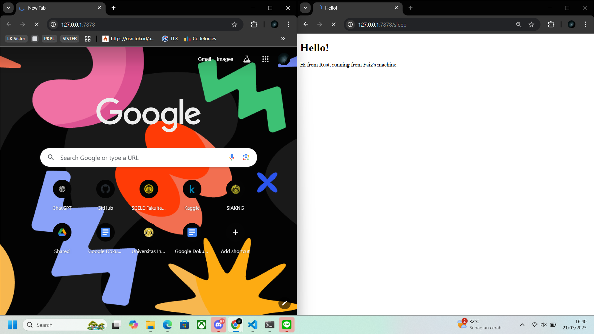

## Commit 1 Reflection Notes  
**Apa isi dari fungsi `handle_connection`?**

Fungsi `handle_connection` bertugas menangani koneksi yang masuk dari browser. Di dalamnya, digunakan `BufReader` untuk membaca data dari `TcpStream` secara efisien baris demi baris. Kemudian, fungsi ini mengumpulkan setiap baris dari permintaan HTTP (HTTP request) sampai menemukan baris kosong yang menandai akhir dari bagian header. Semua baris tersebut disimpan dalam sebuah vector bertipe `String`. Setelah seluruh header berhasil dikumpulkan, isi dari permintaan HTTP tersebut dicetak ke console dengan format yang rapi menggunakan `{:#?}` agar lebih mudah dibaca.

## Commit 2 Reflection Notes  
**Apa yang dilakukan fungsi `handle_connection` setelah update?**

Pada tahap ini, fungsi `handle_connection` diperbarui agar tidak hanya membaca permintaan dari browser, tetapi juga memberikan respons berupa halaman HTML sederhana. File HTML dibaca menggunakan fungsi `fs::read_to_string`, lalu isinya dikemas dalam format HTTP response lengkap dengan status line (`HTTP/1.1 200 OK`) dan `Content-Length` yang sesuai. Respons ini kemudian dikirim kembali ke browser melalui koneksi TCP. Dengan perubahan ini, server sudah mampu menampilkan halaman web statis secara langsung, tanpa menggunakan framework tambahan.

Saya juga memodifikasi file `hello.html` untuk menampilkan pesan pribadi, dan saat mengakses server di browser, halaman tersebut berhasil ditampilkan. Ini membuktikan bahwa server merespons permintaan HTTP dengan benar.

## Commit 3 Reflection Notes 

Pada tahap ini, fungsi `handle_connection` diperluas untuk **memvalidasi permintaan HTTP** dari browser. Program membaca baris pertama request (request line), lalu memeriksa apakah permintaan tersebut mengakses root path `/`. Jika iya, server mengembalikan halaman `hello.html` dengan status `200 OK`. Namun, jika pengguna mengakses URL lain, server akan membalas dengan halaman `404.html` dan status `404 NOT FOUND`.

Perubahan ini membuat server lebih responsif terhadap jenis permintaan yang berbeda, mirip seperti web server nyata yang bisa memberi tahu pengguna jika halaman tidak ditemukan. Saya belajar bagaimana memisahkan logika antara pemrosesan request dan penentuan respon. Selain itu, pendekatan ini membuat kode lebih mudah untuk dikembangkan ke tahap berikutnya, seperti menambah fitur routing lebih kompleks.

## Commit 4 Reflection Notes

Pada milestone ini, saya mensimulasikan request lambat dengan menambahkan endpoint `/sleep` yang menunda respon selama 10 detik. Saya menggunakan `thread::sleep(Duration::from_secs(10))` untuk menciptakan efek delay. Ketika saya mengakses `/sleep` di satu tab browser, lalu mengakses `/` di tab lain, saya melihat bahwa permintaan kedua harus menunggu permintaan pertama selesai terlebih dahulu. Hal ini terjadi karena server masih berjalan di mode single-threaded, sehingga hanya bisa menangani satu koneksi dalam satu waktu.

Dari percobaan ini, saya menyadari keterbatasan server single-threaded dalam menangani banyak pengguna secara bersamaan. Ini memotivasi perlunya implementasi server multithreaded agar permintaan bisa diproses secara paralel dan efisien.

